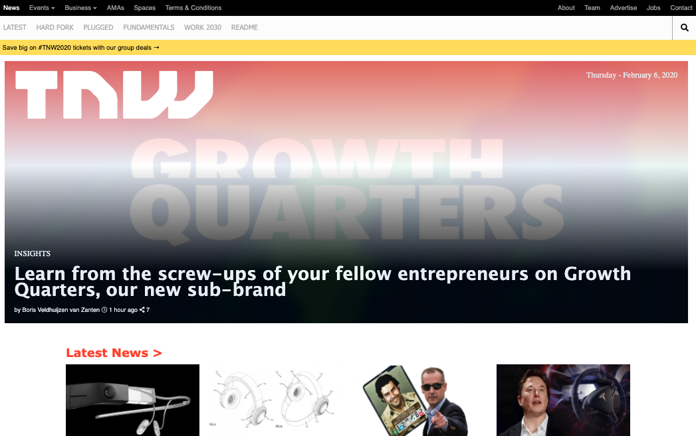
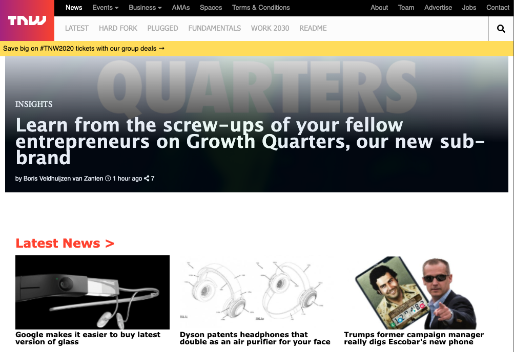

# Building with Responsive Design
> A clone of THE NEXT WEB Homepage that consists of replicating website putting emphasis on how it behaves differently depending on the size of the screen where the website is rendered.

You can find the original project specification at: https://www.theodinproject.com/courses/html5-and-css3/lessons/building-with-responsive-design

**Desktop**

**Tablet**

**Mobile**

## Built With

- Float
- Box Model
- FlexBox
- CSS Grid
- Media Queries
- Gradients

## Live Demo

[Live Demo Link](https://rawcdn.githack.com/Elbie-em/Building-with-Responsive-Design/2471deae3ffbbe58def566c2c48069d815d79b43/index.html)

## Getting Started

**This is a static page and was made using  CSS & HTML, you don't need .**
**anything to start up this page, is already published in a public repository so you can check the final result. For a better understanding of the code read about FlexBox,Grid, Media Queries and Floats.**

## Authors

👤 **Elbie Moonga**

- GitHub: [@Elbie-Em](https://github.com/Elbie-em)
- Twitter: [ElbieEm](https://twitter.com/ElbieEm)
- LinkedIn: [elbie-moonga](https://www.linkedin.com/in/elbie-moonga-253bbb12b/)

👤 **Luis Saavedra**

- Github: [@LuisSaavedra](https://github.com/nriqu322)
- Twitter: [@LuisSaavedra](https://twitter.com/nriqu322)
- Linkedin: [Luis Saavedra](https://linkedin.com/in/luis-saavedra-sanchez/)

## 🤝 Contributing

Contributions, issues and feature requests are welcome!

Feel free to check this link --> [here](https://github.com/Elbie-em/Building-with-Responsive-Design/issues) for issues.

## Show your support

Give a ⭐️ if you like this project!

## 📝 License

This project is [MIT](lic.url) licensed.
